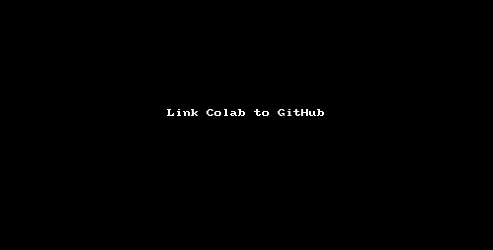

# Masar_DS

My projects with Masar

## Try to upload your codes and notebooks in the (Masar_DS) folder 
- **.py** files
- **Jupyter Notebook**
- **Homework from Google Classroom**
- **Any Cool projects you did**

Here's how you can upload directly from 

**Create a GitHub Account**

**Link your GitHub with Google Colab**

**Upload the notebook to your right folder in GitHub repository**

